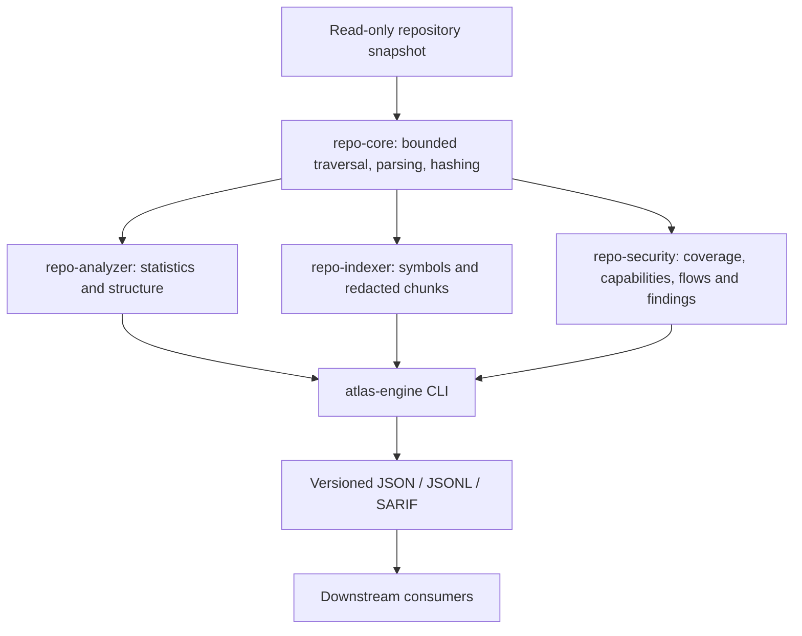

# Atlas Engine

[](rust-toolchain.toml)
[](LICENSE)

Offline, read-only repository analysis, structural indexing, and static security
signals, implemented in Rust. Use it to understand a source tree or produce
redacted records for search without running anything from that tree.

**Status:** source version v0.4.2. The immutable v0.4.1 and v0.4.0 source tags did
not produce GitHub Releases. Published status, assets and attestations must be
verified on GitHub. This is not a claim of a completed third-party security
audit, OpenSSF badge, or SLSA level.

## What it does

- Analyzes files, languages, LOC, manifests, exact duplicates, and largest files.
- Extracts PHP, JavaScript, TypeScript, and Python symbols with Tree-sitter.
- Writes deterministic structural chunks as versioned JSONL, with default secret redaction.
- Emits complete snapshot manifests and opt-in upsert/delete transactions from an accepted base.
- Reports per-file/per-domain security coverage, fixed execution capabilities,
  redacted bounded Python flows, secret patterns and risky configuration.
- Offers opt-in Rust/Shell grammar metrics, resolved static and redacted dynamic
  dependency observations, evidence-labelled test mappings and caller-supplied
  churn hotspots.
- Validates passive external-scanner evidence and hashes private result artifacts;
  it never starts or downloads a scanner.
- Reads basic Git identity without invoking Git or repository-defined commands.

Atlas Engine does not clone repositories, install packages, build scanned code,
generate embeddings, call an LLM, provide an HTTP service, or own a database or
queue. Downstream systems integrate through versioned subprocess contracts and
retain ownership of orchestration and publication. Its one bounded Python flow
model is not a full taint analyzer or a substitute for a specialist SAST tool.

## Architecture



| Directory | Package | Responsibility |
| --- | --- | --- |
| `crates/repo-core` | `atlas-repo-core` | Filesystem, inert Git metadata, languages, parser registry, hashes, redaction primitives |
| `crates/repo-analyzer` | `atlas-repo-analyzer` | Repository summary plus opt-in structural metrics, resolved/dynamic dependency observations, test mappings and manifest-bound hotspots |
| `crates/repo-indexer` | `atlas-repo-indexer` | AST symbols, bounded chunks, stable identities, snapshot manifests and deterministic delta events |
| `crates/repo-security` | `atlas-repo-security` | Honest rule-domain coverage, execution/dataflow signals, passive evidence validation and findings; no exploitability claim |
| `crates/atlas-engine-cli` | `atlas-engine` | Clap commands, machine contracts, diagnostics, exit codes |

See the [architecture decisions](docs/architecture/ADR-001-rust-workspace.md) and
[threat model](docs/security/threat-model.md).
The [v0.2 delivery report](docs/delivery-report-v0.2.0.md) records the snapshot
protocol evidence, actual macOS/Linux verification and remaining publication and
consumer controls. The [v0.1 report](docs/delivery-report-v0.1.0.md) preserves the
initial architecture, dependency/license and source-publication evidence.

## Build and run

Prerequisites: Rustup and a native C/C++ build toolchain (Tree-sitter grammars
compile as part of building **Atlas Engine**, not while scanning a repository).
The workspace pins Rust 1.98.0, Edition 2024. Native Linux and macOS are the
test targets. From this source checkout:

```bash
# If Cargo is not yet on this shell's PATH after installing Rustup:
. "$HOME/.cargo/env"
cargo build --locked --release
./target/release/atlas-engine version
./target/release/atlas-engine analyze ./fixtures
./target/release/atlas-engine index ./fixtures --format jsonl
./target/release/atlas-engine security ./fixtures --format sarif
```

The initial build downloads Cargo dependencies. The resulting executable does not
require network access. Cargo commands in this document are for the trusted
engine checkout only. **Never run package managers or build tools in the input
repository to prepare a scan.** The fixtures intentionally include fake secrets
and dangerous APIs; findings there are expected.

There is no asserted crates.io or binary-release installation command yet. The
[release procedure](docs/releases.md) covers four native artifact targets,
checksums, SBOMs, and verification when maintainers publish them.

## CLI

```bash
atlas-engine analyze /path/to/repo
atlas-engine analyze /path/to/repo --format json --repo-id owner/name
atlas-engine analyze /path/to/repo --format json --repo-id owner/name --advanced
atlas-engine index /path/to/repo --format jsonl --repo-id owner/name
atlas-engine security /path/to/repo --format json
atlas-engine security /path/to/repo --format json --require-complete
atlas-engine security /path/to/repo --format jsonl
atlas-engine security /path/to/repo --format sarif
atlas-engine evidence /state/evidence.json --against /state/snapshot.json \
  --repository-root /path/to/repo --result /private/result.sarif --format json
atlas-engine doctor /path/to/repo
atlas-engine version
atlas-engine analyze /path/to/repo --format json --output /trusted-state/report.json \
  --diagnostics-format jsonl
```

Common scan flags include `--exclude GLOB` (repeatable), `--max-file-size BYTES`,
`--max-files COUNT`, `--max-total-bytes BYTES`, `--max-metadata-bytes BYTES`, `--max-depth COUNT`,
`--max-parse-millis MS`, and `--threads COUNT`. Indexing additionally accepts
`--max-chunk-bytes BYTES`. Every command also accepts a 256 MiB default
`--max-output-bytes` cap, optional atomic no-clobber `--output FILE`, and
`--diagnostics-format jsonl` for a digest-bound terminal
receipt. Run `atlas-engine COMMAND --help` for the exact interface and read the
[diagnostic event contract](docs/contracts/diagnostic-events-v1.md) before
accepting streamed output.

Opt into schema 2.0 transactions separately:

```bash
atlas-engine index /snapshots/base --repo-id owner/name --format events-jsonl
atlas-engine index /snapshots/target --repo-id owner/name --format events-jsonl \
  --since /state/accepted-base.manifest.json
```

`--since` reads an accepted **manifest file**, not a Git ref. v0.2 fully rescans
the target; it avoids retransmitting unchanged chunks but does not accelerate
Git history or parsing. It rejects incompatible configuration/ignore policies,
withholds deletions on incomplete scans, and emits a completion envelope even
for an empty snapshot. Consumers must validate and stage the complete transaction
and atomically compare-and-swap its base. See the
[snapshot protocol](docs/contracts/index-snapshots-v2.md) before using deletions.

Advanced analysis is opt-in. Churn is never read from the repository's Git
database; a consumer supplies a strict manifest outside the checkout and binds
it to an accepted complete snapshot:

```bash
atlas-engine analyze /workspace/repo --format json --repo-id owner/name --advanced \
  --history-manifest /state/history.json \
  --accepted-snapshot /state/snapshot.json
```

Missing complexity/churn values stay `null`; test mappings are evidence labels,
not executed-test coverage, and `branch_points * commit_count` is an integer
prioritization fact rather than a risk probability.

Machine data goes to stdout; diagnostics go to stderr. Consume both separately
and require a matching terminal receipt and acceptable process status before
committing streamed output. Global `--diagnostics-format jsonl`, `--output FILE`,
and `--max-output-bytes BYTES` provide bounded operational
events and primary-output receipts. See the
[diagnostic event contract](docs/contracts/diagnostic-events-v1.md).
Security findings alone do not fail a command; `--fail-on high` explicitly turns
high or critical findings into exit code 5. With `--fail-on`, incomplete coverage
instead returns exit 6, even if no finding was produced. Review `truncated` and
the nested coverage contract; only `complete` domains carry exact counts. The
optional bounded-dataflow domain does not decide the required native gate.
Use `--require-complete` for advanced analysis, native security coverage or
external evidence when incomplete results must fail with exit 6 without applying
a finding threshold.

| Code | Meaning |
| --- | --- |
| 0 | Command succeeded; inspect diagnostics for skipped or unsupported content |
| 2 | CLI or configuration error |
| 3 | Repository/input error |
| 4 | Internal scan/output failure |
| 5 | Explicit security threshold reached |
| 6 | Explicit security gate or schema 2.0 index snapshot was incomplete |

## Languages and contracts

| Languages | Indexing |
| --- | --- |
| PHP, JavaScript, TypeScript, Python | Legacy Tree-sitter symbols and structural chunks; opt-in advanced metrics |
| Shell, Rust | File-level index fallback; opt-in extended grammar and structural metrics |
| JSON, YAML, TOML, Markdown | Language classification and bounded file-level fallback |
| Other UTF-8 text | File-level fallback where eligible |
| Binary/invalid UTF-8 | No source parsing; diagnostic/skip behavior |

Legacy records retain `schema_version: "1.0"`; engine identity is `0.4.2`.
Opt-in index events and snapshot manifests use schema `2.0`; their upsert payloads
remain v1 chunk records. `version --format json` reports legacy, snapshot and
independent contract versions.
Git identity may be absent; absence is not proof of a clean checkout. Index
`chunk_id` describes logical identity, while `content_hash` describes redacted
content. Byte ranges refer to the original source. See [contract semantics and
compatibility](docs/contracts/versioning.md).

- [Analyzer JSON Schema](schemas/analyzer-v1.schema.json)
- [Index record JSON Schema](schemas/index-record-v1.schema.json)
- [Index event JSON Schema](schemas/index-event-v2.schema.json)
- [Index manifest JSON Schema](schemas/index-manifest-v2.schema.json)
- [Security report JSON Schema](schemas/security-report-v1.schema.json)
- [Security finding JSON Schema](schemas/security-finding-v1.schema.json)
- [Security coverage JSON Schema](schemas/security-coverage-v1.schema.json)
- [Execution signal JSON Schema](schemas/execution-signal-v1.schema.json)
- [Bounded dataflow JSON Schema](schemas/bounded-dataflow-signal-v1.schema.json)
- [Advanced analysis JSON Schema](schemas/analyzer-advanced-v1.schema.json)
- [History manifest JSON Schema](schemas/history-manifest-v1.schema.json)
- [Hotspot report JSON Schema](schemas/hotspot-report-v1.schema.json)
- [External scanner evidence JSON Schema](schemas/external-security-evidence-v1.schema.json)
- [Version identity JSON Schema](schemas/version-v1.schema.json)
- [Diagnostic event JSON Schema](schemas/diagnostic-event-v1.schema.json)
- [Diagnostic events and output receipts](docs/contracts/diagnostic-events-v1.md)
- [Doctor JSON Schema](schemas/doctor-v1.schema.json)
- [Subprocess consumer integration](docs/integrations/subprocess-consumers.md)
- [Dependency-free Node.js consumer](examples/node-consumer/README.md)

## Security boundary and limits

Input is hostile. The engine never executes repository code, hooks, binaries,
package lifecycles, external diff/textconv handlers, or dynamic plugins. It does
not follow symlinks. Relative paths are serialized and terminal text is escaped.
It honors engine exclusions, user exclusions, and supported VCS ignore rules.

Defaults bound individual files to 2 MiB, accepted files to 100,000, total scanned
bytes to 1 GiB, retained inventory metadata to a deterministic 64 MiB estimate,
directory depth to 64, and parse work to a cooperative 100 ms per file. Worker
count is bounded. These are limits, not throughput or RSS promises. The metadata
estimate charges normalized path bytes plus fixed record costs, including bounded
diagnostic and ignore metadata. Allocator overhead, temporary walk state,
per-worker source/parser state, and output record sizes still consume memory.
Raising bounds needs measurements and caller-enforced CPU, memory, wall-time, and
output limits. No multi-GB source tree is loaded as one string; skipped content
means a scan may be incomplete.

Native parsers can crash or run beyond cooperative deadlines. A read-only mount,
network denial, immutable checkout, and external process/container limits remain
the caller's responsibility. Ignore rules and bounds can hide content; review
diagnostics before treating a scan as sufficient evidence.

Secret detection covers selected recognizable patterns, not every possible
credential. Redaction is always enabled for indexing and cannot prove that all
remaining content is safe to upload. Findings report a dangerous primitive or
sensitive pattern, not a confirmed exploitable vulnerability. See
[scanner limitations](docs/security/scanner-limitations.md) before embedding or
publishing output.

## Quality and project status

```bash
cargo fmt --all -- --check
cargo clippy --locked --workspace --all-targets --all-features -- -D warnings
cargo test --locked --workspace --all-features
cargo build --locked --workspace --release
cargo deny --locked check
node --test examples/node-consumer/consumer.test.mjs
```

[CONTRIBUTING.md](CONTRIBUTING.md) documents tool installation and additional
checks. Fuzz targets are separate from normal builds. Performance claims require
measurements under the [benchmark methodology](docs/benchmarks.md).

[OSPS Baseline assessment](docs/security/openssf-osps-baseline.md),
[Best Practices preparation](docs/security/openssf-best-practices.md), and
[GitHub hardening](docs/security/github-hardening.md) separate local evidence from
settings and hosted operations that still need owner action. The
[roadmap](ROADMAP.md) separates delivered snapshot/security/analysis contracts
from future safe Git-object and parser-cache acceleration.

## Contributing, support, and licensing

Start with [CONTRIBUTING.md](CONTRIBUTING.md), [governance](GOVERNANCE.md), and the
[Code of Conduct](CODE_OF_CONDUCT.md). See [SUPPORT.md](SUPPORT.md) for ordinary
questions and defects. **Do not post vulnerabilities or real secrets in public
issues**; follow [SECURITY.md](SECURITY.md).

Project code is dual licensed under [MIT](LICENSE-MIT) OR
[Apache-2.0](LICENSE-APACHE), at your option. Dependencies retain their own terms;
the [dependency policy](docs/security/dependency-policy.md) describes review and
release notices. Tree-sitter, its language grammars, and the Rust ecosystem make
this project possible; upstream attributions are retained in release archives.
