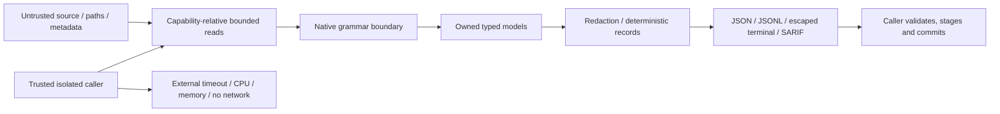

# Threat model

Scope: the current local-directory scan path, its public outputs, and build/release
delivery. Input repositories are hostile. The owner of the engine executable and
the caller's isolated worker are trusted. The engine is not an OS sandbox.

Assets include host filesystem confidentiality/integrity, process resources,
source secrets, truthful output provenance, downstream indexes, CI credentials,
and release integrity. Entry points are the root path, filenames, file contents,
ignore/Git metadata, CLI options, parser libraries and consumer streams.

## Threats, controls, and residual risks

| Threat | Current control/evidence | Residual risk or caller requirement |
| --- | --- | --- |
| Malicious source, hooks, package lifecycles, embedded binaries | No scan-path subprocess API; CLI integration test `git_hooks_configuration_and_fixture_lifecycle_scripts_are_never_executed` | Building the engine/dependency tools is a separate trusted operation; never build the input |
| Path traversal and absolute-path leakage | Relative path models, typed diagnostics, JSON serialization; core traversal and CLI portability tests | Consumers must still validate paths before filesystem use |
| Root/descendant symlink escape and check/open races | Capability-relative `nofollow` checks for components, revalidated bounded reads; tests `root_and_descendant_links_never_escape` and `reread_refuses_an_intermediate_directory_symlink_swap` | Use an immutable read-only snapshot; concurrent filesystem mutation can cause skips |
| Host files aliased through hardlinks or nested mounts | The trusted caller defines the filesystem visible under the root capability | The engine does not identify outside aliases of regular inodes or reject mount points. Materialize an isolated snapshot; do not expose host data through hardlinks/bind mounts inside it |
| FIFO/device/special files | Type checks before/after open and nonblocking Unix open; `special_files_are_skipped_without_reading` and Linux non-UTF-8 name tests | Tested platforms are Linux/macOS; other OS behavior is not asserted |
| Large files and misleading file sizes | Per-file/count/read-byte/depth limits, bounded allocations and skipped diagnostics | OS RSS limits remain necessary, especially after raising defaults |
| Binary/encoding bombs | Binary classification, UTF-8 checks, no archive support | Zip/archive extraction is out of scope; any future archive feature needs decompression and expansion limits first |
| Parser crashes / memory corruption | Own Rust forbids unsafe; bounded Tree-sitter wrapper, parse diagnostics and fuzz targets | Native dependencies contain unsafe/C code; isolate the whole process; fuzz seeds are not a sustained campaign |
| CPU exhaustion | Bounded threads, parser deadline/node/depth limits, bounded ignore metadata | Parser deadline is cooperative; terminate the process externally on deadline |
| Memory exhaustion | File/source budgets, bounded workers, bounded per-file chunk records, metadata limits | Inventory and per-worker parse state still scale; no fixed RSS guarantee |
| Malicious Git config, hooks, diff drivers, textconv | Inert direct metadata only; no Git process, config evaluation, object-history execution or external discovery | No full churn/history; unsupported Git formats are unknown, not invented |
| Linked worktree `.git` pointers or metadata symlinks | Only ordinary `.git` directories and bounded supported metadata are read | Linked worktrees/submodule pointers report unsupported metadata rather than reaching outside root |
| Ignore manipulation or parent configuration influence | Scoped ignore matcher, policy/source diagnostics, bounded metadata; tracked index membership overrides VCS ignores | Engine/user exclusions still win. Ignored/unreadable/skipped content is not scanned |
| Secrets in source or metadata | Shared high-confidence detector; full-file redaction before chunking; no full secret in security findings | False negatives and personal/private data remain possible; output is not automatically publishable |
| Secret fingerprint dictionary attacks | Index hashes are of emitted redacted content, not hidden secret bytes | Core source hashes can expose low-entropy equality; restrict access and avoid unnecessary publication |
| Terminal escapes and bidi filenames | CLI `safe_text`, limited output and escaped controls; `hostile_filenames_cannot_inject_json_sarif_or_terminal_escape_sequences` | Do not render raw consumer stderr/source as terminal control data |
| JSON/SARIF injection or unsafe URIs | Serde escaping, relative path/URI handling and validation against local schemas | Serialization does not make data safe as HTML, shell syntax, or filesystem destinations |
| Truncated/failed stream poisons index | Node consumer stages records and requires validated EOF plus exit 0; timeout/error tests | Exit 0 alone does not prove coverage; caller must evaluate diagnostics and acquisition state |
| Resource exhaustion passes a security gate without findings | `truncated` reports lost coverage; an explicit `--fail-on` gate exits 6 on incomplete input/parser/reporting results | Intentional exclusions remain outside the selected scope; detection is heuristic, not proof of absence |
| Dependency compromise | Locked dependencies, source/license/advisory policy, pinned actions, CodeQL preparation | A lockfile and scanner cannot prove supply-chain safety; review build scripts, native code and updates |
| CI token compromise from PRs | Hosted unprivileged build/CodeQL jobs, no `pull_request_target`, no persisted checkout credentials; separate upload job | Owner must enforce permissions, trusted workflow review and branch rules |
| Release compromise | Native build jobs without write/OIDC, separate environment-gated attestation/draft job, tag validation, checksum set | Owner must enable approvals/tag rules, verify source/run/artifact identity and publish deliberately |

## Git assumptions and missing metrics

Recognized ordinary Git metadata includes detached HEAD (40/64 hex), branch refs,
loose refs and bounded packed refs. Index membership uses structurally recognized
v2/v3 SHA-1 layouts; unsupported v4/split/sparse/corrupt forms yield unknown
tracking. Membership is advisory and is not proof that a file was committed in
HEAD, that its content is unchanged, or that a directory is a clean clone.
Git history/churn, complexity and data-flow are not fabricated from these fields.

## Verification and review status

Evidence lives in [core traversal tests](../../crates/repo-core/tests/traversal.rs),
[index tests](../../crates/repo-indexer/tests/indexing.rs),
[CLI contract/SARIF tests](../../crates/atlas-engine-cli/tests/contracts.rs),
[consumer tests](../../examples/node-consumer/consumer.test.mjs), and
[fuzz targets](../../fuzz/README.md). A test file is evidence of coverage intent;
record actual commands/platform/results in the delivery/release report before
claiming a pass. Threat modeling here is an initial design assessment, not an
independent penetration test or a completed external security audit.

Review changes to traversal, metadata parsing, redaction, chunk identity, output
formats and CI privileges as security-sensitive. Rerun relevant regression/property
tests and fuzz targets. New archive, network, execution or plugin support requires
a new threat model and explicit scope approval.

## v0.2 manifest and transaction boundary

The existing input/code-execution limits above still apply. Snapshot mode adds
an explicit consumer-owned baseline input and an event stream; it does not
upgrade observed Git HEAD into verified acquisition or source immutability.

| Threat | v0.2 control | Residual requirement |
| --- | --- | --- |
| Malicious baseline JSON or metadata exhaustion | 16 MiB bounded reader; 50,000 file/chunk bounds; strict fields, portable paths, unique ordered IDs and canonical hash | Trusted baseline ownership; a self-consistent hash is not authentication |
| Baseline link/FIFO redirection | Resolved containment check, component no-follow directory capabilities, final no-follow nonblocking open and type/size checks | Caller-owned immutable state directory; no claim to distinguish hardlink/mount aliases |
| Partial target silently deletes old chunks | No delete emission before complete reread/index; failures/limits/unknown diagnostics abort; exclusions covering base paths abort | Immutable input, explicit scan policy and process resource limits supplied by caller |
| Ignore/configuration drift changes index scope | Versioned exact configuration and read-ignore-selection fingerprints; mismatch rejects the base before output | Full-snapshot policy changes require caller review, not automatic fallback |
| Corrupt/reordered/truncated events | Byte-exact event hash, complete footer, manifest and counts; output failures propagate | Consumer validates sequence/hash/records and requires EOF plus exit 0; a footer alone is insufficient |
| Stale concurrent job overwrites a newer index | Events identify accepted base and deterministic target/transaction | Consumer must implement atomic compare-and-swap and idempotent retry persistence |
| Unchanged chunk retains old commit or location metadata | Record hash includes content/ranges/metadata, excluding only commit; target manifest owns commit provenance | Consumer rebinds retained records and verifies materialized inventory before switching |

The v2 schema and library tests cover local protocol behavior. They do not
certify a consumer database transaction, OS sandbox, Git ancestry, a fuzz
campaign or a published release. The Node example remains a v1 consumer.
